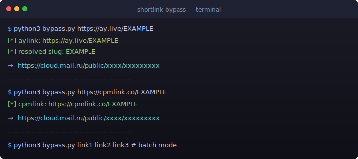

<p align="center">
  
</p>

<h1 align="center">🔗 ShortLink Bypass</h1>
<p align="center">
  <b>ay.live · aylink.co · cpmlink.co · cpmlink.pro</b>
  <br>
  <i>No ads. No countdowns. Just the real link.</i>
</p>

<p align="center">
  
  
  
  
</p>

---

## 🚀 What is this?

A **zero-dependency** Python script that bypasses ad-filled shortlink pages and gives you the **final destination URL directly**.

**Supported services:**
| Domain | Type |
|--------|------|
| `ay.live` | Redirect → aylink.co |
| `aylink.co` | Turkish shortener (cloud.mail.ru) |
| `cpmlink.co` | Paid CPM shortener |
| `cpmlink.pro` | Mirror of cpmlink.co |

> **Why?** These sites make you wait 5+ seconds, show popup ads, and track your clicks. This script goes straight to the API — no ads, no waiting.

---

## ⚡ Usage

```bash
# Single link
python3 bypass.py https://ay.live/ODNsR

# Multiple links (batch mode)
python3 bypass.py https://ay.live/abc https://cpmlink.co/xyz

# Pipe-friendly (just URLs on stdout)
python3 bypass.py https://ay.live/ODNsR 2>/dev/null
```

**Output:**
```
[*] aylink: https://ay.live/ODNsR
[*] resolved slug: ODNsR
→ https://cloud.mail.ru/public/D1EW/MAF6JJ7AQ
```

---

## 🛠 How it works

These shorteners use a common architecture:

1. **Landing page** loads with JavaScript variables (`_a`, `_t`, `_d`)
2. **Countdown** runs (5 seconds of ads)
3. **Client-side JS** sends `_a`, `_t`, `_d` to `/get/tk` → receives token
4. **Client-side JS** POSTs to `/links/go2` with token + fake browser signal
5. Server returns the **real URL**

This script **replicates steps 1→3→4** without loading a browser or showing ads. It also handles the intermediate `bildirim.online` redirect to `cloud.mail.ru`.

---

## 📦 Dependencies

**None.** Just Python 3.8+ and `curl` (pre-installed on virtually every system).

```bash
# Check if curl is available
which curl
```

---

## 🧪 Test links

| Shortlink | Expects |
|-----------|---------|
| `https://ay.live/ODNsR` | cloud.mail.ru/public/D1EW/MAF6JJ7AQ |
| `https://ay.live/jA9Lnl` | cloud.mail.ru/public/uZy4/PFZ6TTYEE |
| `https://cpmlink.co/7VcB` | cloud.mail.ru/public/Y7iD/tAQiHhYjs |
| `https://cpmlink.co/ZPDF7` | cloud.mail.ru/public/kx4Y/AboSZ33tx |

> **Note:** These links may expire. The script will still work with any valid aylink/cpmlink URL.

---

## 🔧 Advanced: Telegram Bot Integration

You can easily wrap this in a Telegram bot:

```python
import subprocess

def bypass(url):
    r = subprocess.run(
        ["python3", "bypass.py", url],
        capture_output=True, text=True, timeout=30
    )
    return r.stdout.strip().split("\n")[-1]  # last line = final URL
```

---

## ⚠️ Disclaimer

This tool is for **educational purposes only**. Bypassing shorteners may violate their Terms of Service. Use at your own risk.

The author is not responsible for how you use this tool or any content accessed through it.

---

## 🤝 Contributing

Found a dead link? API changed? Open an issue or PR!

To-do:
- [ ] Add more shortlink services (adf.ly, ouo.io, shorte.st)
- [ ] Web interface (Flask/FastAPI)
- [ ] Docker image
- [ ] GitHub Actions auto-test

---

<p align="center">
  <sub>Made with ☕ and curiosity</sub>
</p>
